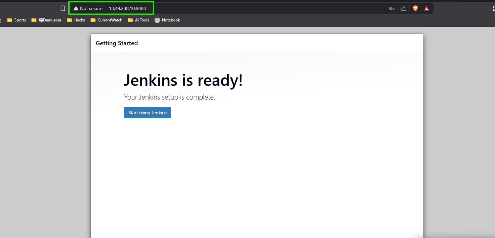
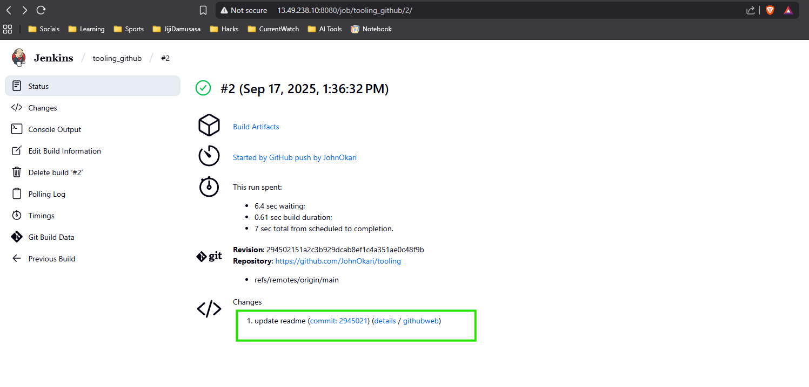
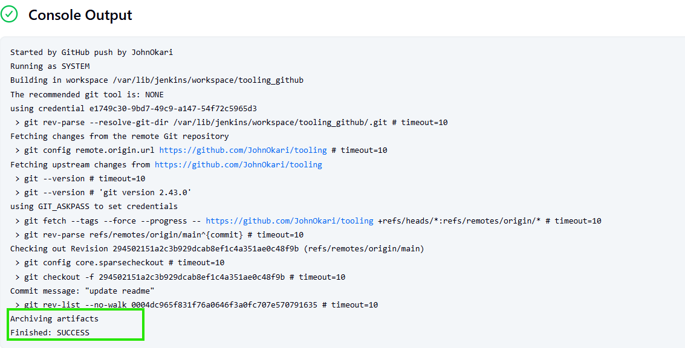

---

# 🚀 Tooling Website Deployment Automation with Jenkins CI

This project demonstrates how to set up a **Continuous Integration (CI) pipeline** for automating the deployment of the Tooling Website using **Jenkins**. The pipeline builds artifacts from a GitHub repository and deploys them onto an **NFS server** where web servers can retrieve them.

---

## 📌 Prerequisites

Before starting, ensure you have:

* An **AWS account** with permissions to create and manage **EC2 instances** and **Security Groups**.
* An **NFS server** (running on RHEL 8) with `/mnt/apps` mounted and available.
* A **GitHub repository** containing your Tooling Website code.
* Basic knowledge of **Linux commands, SSH, and Git**.

---

## ⚙️ Step 1: Install Jenkins Server

1. **Create an EC2 Instance**

   * Launch an EC2 instance with **Ubuntu Server 20.04 LTS**.
   * Name it `Jenkins`.
   * Open **TCP port 8080** in its Security Group.

2. **Update and Install Java**

   ```bash
   sudo apt update
   sudo apt upgrade -y
   sudo apt install openjdk-11-jdk -y
   ```

3. **Add Jenkins Repository Key**

   ```bash
   curl -fsSL https://pkg.jenkins.io/debian-stable/jenkins.io-2023.key | \
     sudo tee /usr/share/keyrings/jenkins-keyring.asc > /dev/null
   ```

4. **Add Jenkins Repository**

   ```bash
   echo deb [signed-by=/usr/share/keyrings/jenkins-keyring.asc] \
     https://pkg.jenkins.io/debian-stable binary/ | \
     sudo tee /etc/apt/sources.list.d/jenkins.list > /dev/null
   ```

5. **Install Jenkins**

   ```bash
   sudo apt update
   sudo apt install jenkins -y
   ```

6. **Start and Verify Jenkins**

   ```bash
   sudo systemctl enable jenkins
   sudo systemctl start jenkins
   sudo systemctl status jenkins
   ```

   * By default Jenkins server uses TCP **port 8080** - open it by creating a new Inbound Rule in your EC2 Security Group.

7. **Initial Setup**

   * Open `http://<Jenkins-Public-IP>:8080` in a browser.
   * Retrieve the default admin password:

     ```bash
     sudo cat /var/lib/jenkins/secrets/initialAdminPassword
     ```
   * Install **Suggested Plugins**.
   * Create an **Admin User** and complete setup.

   You sshould see 
   
---

## ⚙️ Step 2: Configure Jenkins Job

1. From the Jenkins dashboard:

   * Click **New Item** → **Freestyle Project**.
   * Link your **GitHub repository** under **Source Code Management**.
   * Add a **Build Step** (e.g., Shell command to build or prepare artifacts).

2. Verify artifacts are being generated locally on the Jenkins server.

     

Here’s a clean **README-style guide** you can use for your Jenkins Freestyle Job setup:

---

## Jenkins Freestyle Job Setup for GitHub Projects

This guide explains how to create a Jenkins Freestyle job to pull code from GitHub, build artifacts, and archive them for download.

---

## 1. Create the Freestyle Job

1. From the Jenkins dashboard, click **New Item**.
2. Enter a job name (e.g., `tooling-website-build`).
3. Select **Freestyle project** and click **OK**.
4. The job configuration page will open.

---

## 2. Link Your GitHub Repository (Source Code Management)

1. Under **Source Code Management**, select **Git**.
2. In **Repository URL**, paste either:

   * **SSH URL**: `git@github.com:ORG/REPO.git` *(recommended for private repos with SSH key)*
   * **HTTPS URL**: `https://github.com/ORG/REPO.git` *(use GitHub username + PAT)*
3. Add credentials by clicking **Add → Jenkins**:

   * **SSH**: Choose **SSH Username with private key**, set username as `git` (or `ec2-user`), and paste the private key.
   * **HTTPS**: Choose **Username with password**, provide GitHub username, and a **Personal Access Token (PAT)** as the password.
4. Select the added credential from the dropdown.
5. In **Branches to build**, set your branch (e.g., `*/main` or `*/master`).

---

## 3. Configure Build Triggers (Optional but Recommended)

1. Scroll to **Build Triggers** in job config.
2. Tick **GitHub hook trigger for GITScm polling**.
3. In your GitHub repository:

   * Go to **Settings → Webhooks → Add webhook**.
   * Set **Payload URL**:

     ```
     http://<JENKINS_PUBLIC_IP_OR_DOMAIN>:8080/github-webhook/
     ```
   * Choose **Content type**: `application/json`.
   * Select **Just the push event** (or push + PR).
   * Save webhook.

👉 Test it by pushing a commit to your repo.

---

## 4. Add Build Steps (Produce Artifacts)

1. In job config, go to **Build → Add build step → Execute shell**.
2. Enter the build commands. Example for a static site:

   ```bash
   # Print debugging info
   echo "Branch: $GIT_BRANCH"
   echo "Commit: $GIT_COMMIT"
   echo "Workspace: $WORKSPACE"
   echo "Build Number: $BUILD_NUMBER"

   # Prepare artifacts folder
   mkdir -p $WORKSPACE/artifacts/$BUILD_NUMBER

   # Copy project files into artifacts
   cp -r . $WORKSPACE/artifacts/$BUILD_NUMBER
   ```

---

## 5. Save and Run a Build

1. Click **Save**.
2. On the job page, click **Build Now**.
3. Open the build number under **Build History** → **Console Output** to monitor logs.
4. Confirm the build steps ran successfully.

---

## 6. Archive Build Artifacts (Download from Jenkins UI)

1. In job config, under **Post-build Actions**, click **Add post-build action → Archive the artifacts**.
2. Set **Files to archive**, e.g.:

   ```
   artifacts/**
   ```

   Or specify patterns like:

   * `target/*.jar`
   * `build/libs/*.jar`
   * `dist/**`
   * `public/**`
3. Save and run the build again.
4. After completion, open the build page → **Artifacts** to download outputs.

---

✅ With this setup, your Jenkins Freestyle job will automatically pull from GitHub, build, archive artifacts, and allow downloads via the Jenkins UI.

---


---

## ⚙️ Step 3: Configure Jenkins to Copy Files to NFS Server

1. **Install “Publish Over SSH” Plugin**

   * Go to **Manage Jenkins → Manage Plugins → Available**.
   * Search for **Publish Over SSH** and install it.
   
     

2. **Configure SSH Access to NFS Server**

   * Go to **Manage Jenkins → Configure System**.
   * Scroll to **Publish Over SSH** section and add:

     * **Name**: `NFS-Server`
     * **Hostname**: Private IP of NFS server
     * **Username**: `ec2-user`
     * **Remote Directory**: `/mnt/apps`
     * **Key**: Paste contents of your **.pem file** used for SSH access
   * Test configuration → should return **Success**.

   ⚠️ Make sure **TCP port 22** is open on your NFS server.

3. **Add Post-Build Action**

   * Open your Jenkins Job configuration.
   * Add **Send build artifacts over SSH** under **Post-build Actions**.
   * Select your configured NFS server.
   * Remote Directory: `/mnt/apps`
   * Files to send: `**` (to copy all files).

4. **Trigger the Pipeline**

   * Make a change in your GitHub repository (e.g., edit `README.md`).
   * Jenkins will trigger automatically (via webhook) or manually.
   * Console Output should show:

     ```
     SSH: Transferred 25 file(s)
     Finished: SUCCESS
     ```

5. **Verify on NFS Server**

   * SSH into the NFS server and check:

     ```bash
     cat /mnt/apps/README.md
     ```
   * If changes are reflected → ✅ Deployment is successful!

---

## 🎉 Outcome

You have successfully:

* Installed and configured **Jenkins CI server**.
* Set up **automated builds** from GitHub.
* Configured Jenkins to **deploy artifacts** to an **NFS server** over SSH.

This marks your first **Continuous Integration (CI) pipeline** for automated website deployment.

---

## 🔮 Next Steps

* Add **Automated Tests** into your Jenkins pipeline.
* Explore **Jenkins Pipelines (Declarative/Scripted)** instead of Freestyle jobs.
* Integrate **Slack/Email notifications** for build results.
* Implement **Continuous Delivery (CD)** for automated deployments to production web servers.

---

💡 *This project is part of the DevOps/Cloud Engineering journey to mastering CI/CD pipelines with Jenkins.*

---

